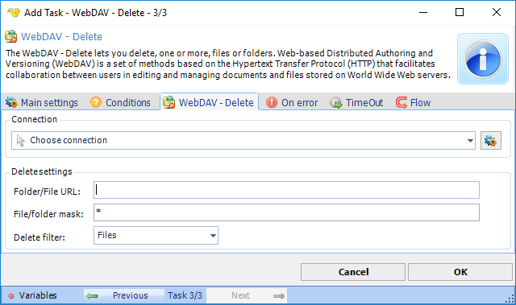

## Task Net - WebDAV - Delete

The WebDAV - Delete lets you delete, one or more, files or folders. Web-based Distributed Authoring and Versioning (WebDAV) is a set of methods based on the Hypertext Transfer Protocol (HTTP) that facilitates collaboration between users in editing and managing documents and files stored on World Wide Web servers.

**Connection**

All WebDAV Task uses connection settings from a Connection. In Connections you can create a new WebDAV connection with all other details like Proxy. In the combo box you select the Connection after creation.
 
**Folder URL**

The full remote base folder URL.
 
**File/folder mask**

This field is able to use either the exact name of a file or folder you want to delete or a combination with wild cards to find one or more files.
 
**Delete filter**

If the file/folder mask should look for Files or Folders when deleting.