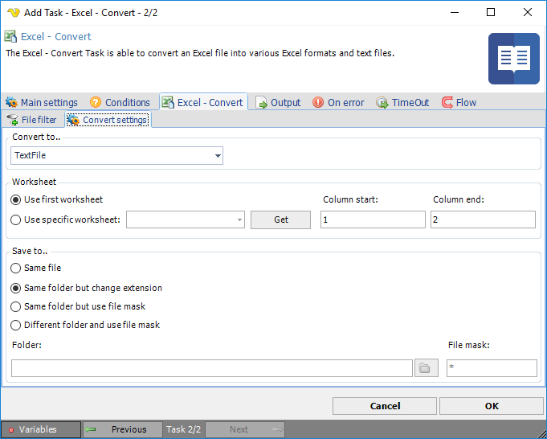

## Task Office - Excel - Convert

The Excel - Convert Task is able to convert an Excel file into various Excel formats and text files
 
**Excel - Convert > File filter > Location** sub tab

The Excel convert Task uses the standard VisualCron [File filter](../../../serverjob-tasks-file-filter) to define the source file to be converted.
 
**Excel - Convert > Convert settings** sub tab

**Convert to ..**

Select the desired format of the destination file.
 
**Worksheet**

Specify the source worksheet and the position in that worksheet. Press the Get button to populate the list of existing worksheets.
 
**Save to ..**

Enter destination file and folder name.
 
**Folder**

If *Different folder and use file mask* is selected, use manual folder specification or folder button
 
**File mask**

Save file with different name
