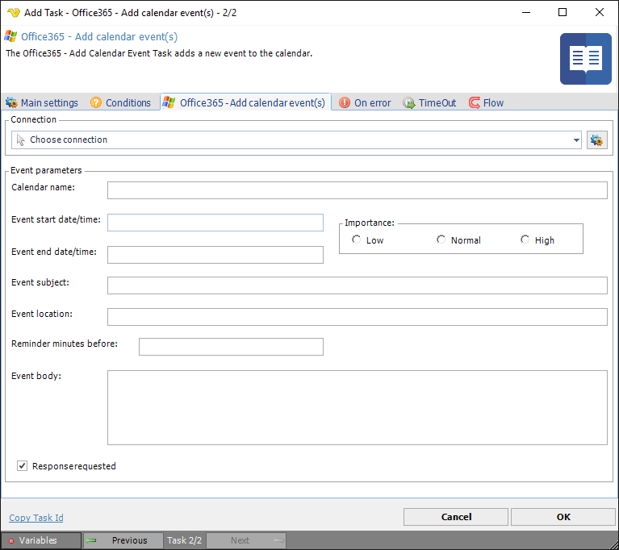

## Task Office365 - Add Calendar Event

The Office365 - Add Calendar Event Task lets you add a Calendar event in the Office365 cloud. The Task uses the [Office365 Connection](../../connection-office365).
 
**Office365 - Add calendar event** tab

**Connection**

To use the Office365 Tasks you need to create a [Connection](../../global-connections) first. Click the *Settings* icon to open the *Manage Connections* dialog.
 
**Event parameters**

Event properties to be entered for the calendar event to be added.