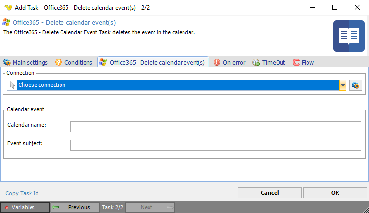

## Task Office365 - Delete Calendar Event

The Office365 - Delete Calendar event Task lets you delete a Calendar event in the Office365 cloud. The Task uses the [Office365 Connection](../../connection-office365).
 
**Office365 - Delete calendar event** tab

**Connection**

To use the Office365 Tasks you need to create a [Connection](../../global-connections) first. Click the *Settings* icon to open the *Manage Connections* dialog.
 
**Calendar event**

*Calendar name* and *Event subject* for the calendar event to be deleted.

