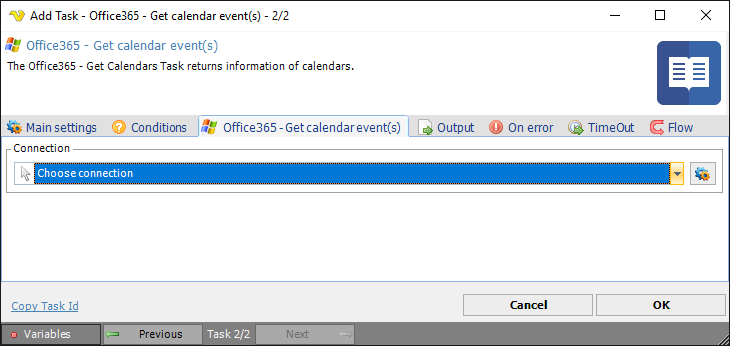

## Task Office365 - Get Calendar Events

The Office365 - Get Calendar event(s) Task lets you retrieve a Calendar event from the Office365 cloud. The Task uses the [Office365 Connection](../../connection-office365).
 
**Office365 - Get calendar events** tab

**Connection**

To use the Office365 Tasks you need to create a [Connection](../../global-connections) first. Click the *Settings* icon to open the *Manage Connections* dialog.
