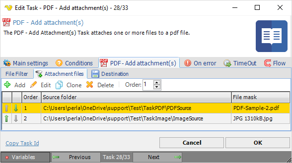
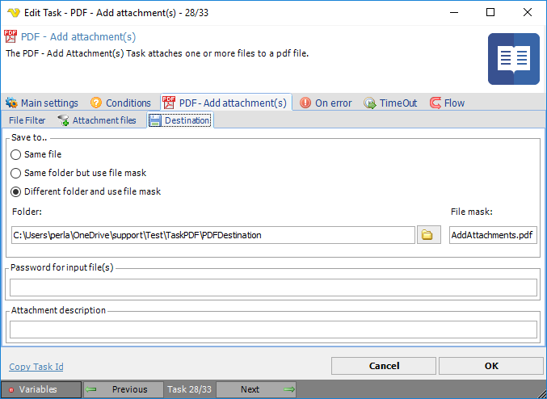

## Task PDF - Add Attachment

The PDF - Add attachment(s) Task attaches one or more files to a pdf file.
 
**Add  attachment(s) > File filter > Location** sub tab

This tab uses the common [file filter](../../job-tasks-file-filter.md) to filter out the files that should be processed in this Task.
 
**Add  attachment(s) > Attachment files** sub tab

In the Attachment files dialog you add, edit, clone or delete files and change order of the items. Changes can be done either by the toolbar buttons or mouse double click on an item.
 
**Add attachment(s) > PDF Destination** sub tab

**Save to**

The destination folder and file mask which the output file is saved to.
 
**Folder**

If *Different folder and use file mask* is selected, use manual folder specification or click the *Folder* icon.
 
**File mask**

Save file with different name.
 
**Password for input files**

Enter password if desired (optional setting).
 
**Attachment description**

Enter description to label the attached files (optional setting).