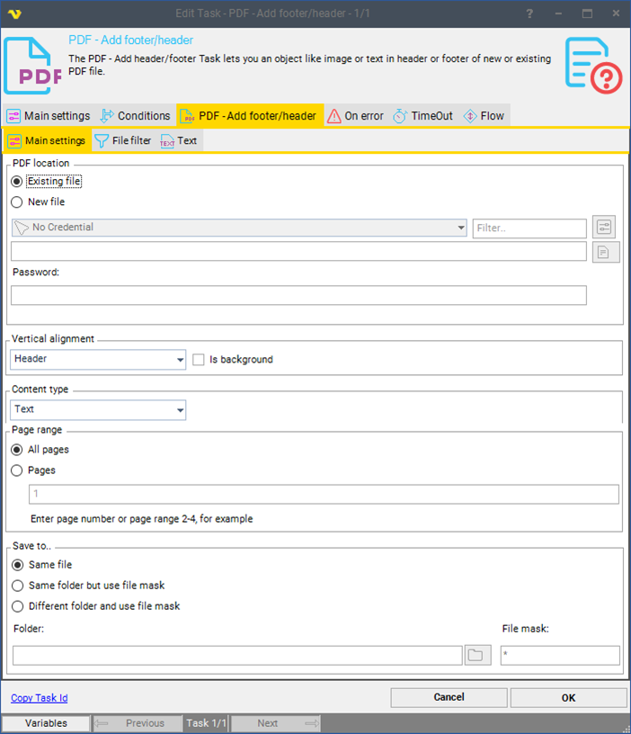
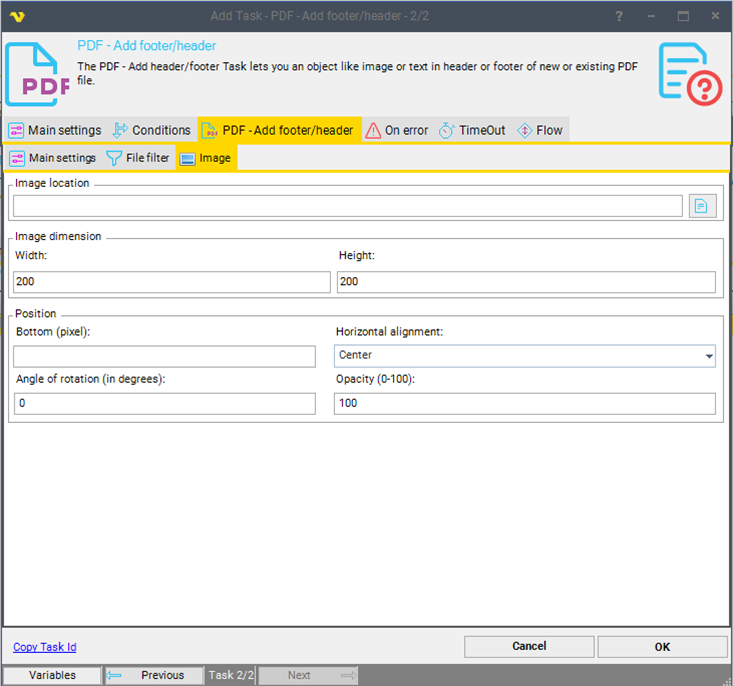
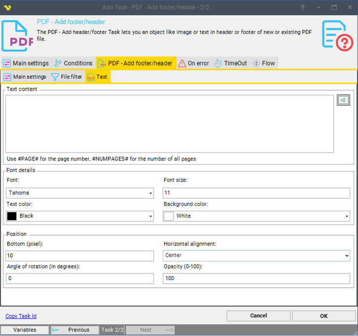

## Task PDF - Add Footer/Header

The PDF - Add footer/header Task lets you add an object like image or text in footer or header to a new or existing PDF file.
 
**Add footer/header > Main settings** sub tab

**Existing/New file**

Select Existing or New PDF file to operate upon, if new file enter file name. Click the *File* icon to browse location and file name for the PDF file.
 
**Password**

If the file is or will be password protected, enter password.
 
**Vertical alignment**

Select Header, Footer or Center vertical alignment of the image or text to be added. The *Is background* puts the image or text in the background of the document.
 
**Content type**

Select the Text or Image type
 
**Page range**

Set the operation to be performed on *All pages* or a range of pages.
 
**Save to**

The destination folder and file mask which the output file is saved to.
 
**Folder**

If *Different folder* and *use file mask* is selected, click the *Folder* icon to browse and select folder.
 
**File mask**

Save file with different name.
 
 
**Add footer/header > File filter** sub tab

This tab uses the common [file filter](../../job-tasks-file-filter) to filter out the files that should be processed in this Task.
 
 
**Add footer/header > Imag**e sub tab

This tab appears after choosing an Image content type in the Main settings tab.

**Image location**

Full path to the file containing the image.
 
### Image dimension settings
 
**Width**

Desired width of the image on the page.
 
**Height**

Desired height of the image on the page.
 
### Position settings
 
**Bottom/Top (pixel)**

Customize the bottom/top margin of the image in pixels
 
**Horizontal alignment**

Choose Left, Center or Right horizontal alignment of the image to be added. 
 
**Angle of rotation (in degrees)**

Customize the rotate angle of image in degrees. This property allows to set arbitrary rotate angle.
 
**Opacity (0-100)**

Customize the value to indicate the image opacity. The value is from 0 to 100. By default the value is 100.
  
**Add footer/header > Text** sub tab

This tab appears after choosing a Text content type in the Main settings tab.

**Text content**

Formatted text that will be added to the PDF file. It is possible to use the macro #PAGE# to add the page number, #NUMPAGES# for the number of all pages.
 
### Font details
 
**Font**

Customize the font of the text.
 
**Font size**

Customize the font size of the text.
 
**Text color**

Customize the foreground color of the text.
 
**Background color**

Customize the background color of the text.
 
### Position settings
 
**Bottom/Top (pixel)**

Customize the bottom/top margin of text.
 
**Horizontal alignment**

Choose Left, Center or Right horizontal alignment of the text to be added. 
 
**Angle of rotation (in degrees)**

Customize the rotate angle of text in degrees. This property allows to set arbitrary rotate angle.
 
**Opacity (0-100)**

Customize the value to indicate the text opacity. The value is from 0 to 100. By default the value is 100.