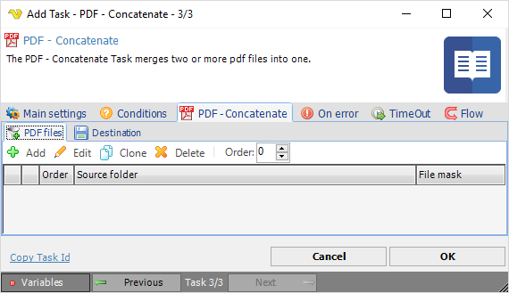
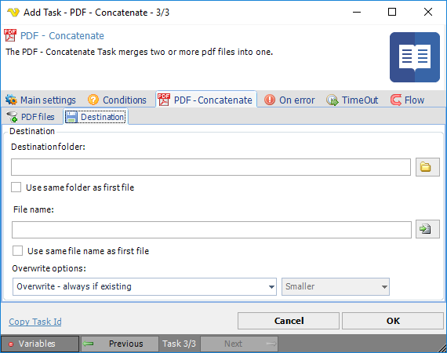

## Task PDF - Concatenate

The PDF - Concatenate Task merges two or more files into one.
 
**Concatenate > PDF files** sub tab

In the PDF files tab you control which pdf files you want to concatenate and which order they should be added. Click the Add icon to select files using multiple [File filters](../../job-tasks-file-filter).
 
**Concatenate > Destination** sub tab

**Destination folder**

The folder the new file should be stored in. Can be overridden by option *Use same folder as first file*. Click the *Folder* icon to browse and select a folder.
 
**Use same folder as first file**

When checking this you use the folder from the first file that was found (in File filter - item 1).
 
**File name**

Name of the concatenated file - can be overridden by option *Use same file name as first file*.
 
**Use same file name as first file**

When checking this you use the file name from the first file that was found (in File filter - item 1).
 
**Overwrite options**

If a file exists you can choose Overwrite based on various criteria.
