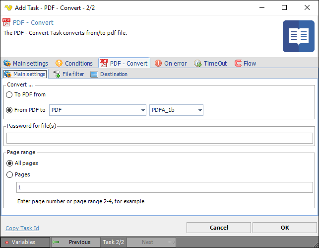
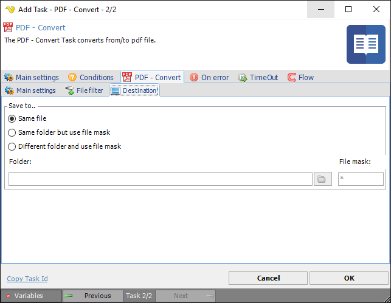

## Task PDF - Convert

The PDF - Convert Task can convert between different file formats and the PDF format.
 
**Convert > Main settings** sub tab

**To PDF->From**

Currently this Task can convert ***to*** PDF from the following formats;
 
* XPS
* PCL
* SVG
* EPUB
* MHT
* HTML
* TeX
* TXT
* CGM
* XML
* IMAGE (various formats)
 
**From PDF->To**

Currently this Task can convert ***from*** PDF to the following formats;
 
* PDF (various formats)
* HTML
* DOC
* XLS
* PPT
* XPS
* XML
* TeX
* TXT
* SVG
* EPUB
* IMAGE (various formats)
 
**Password for file(s)**

If any of the specified PDF files contains a password it should be entered here
 
**Page range**

The pages that should be converted. Specify a range like 2-4 or specific pages 1,3,5-6.
 
**Convert > File filter > Location** sub tab

This tab uses the common [file filter](../../job-tasks-file-filter) to filter out the files that should be processed in this Task.
 
**Convert > Destination** sub tab

**Save to**

The destination folder and file mask which the output file is saved to.
 
**Folder**

If *Different folder and use file mask* is selected, use manual folder specification or click the *Folder* icon.
 
**File mask**

Save file with different name.