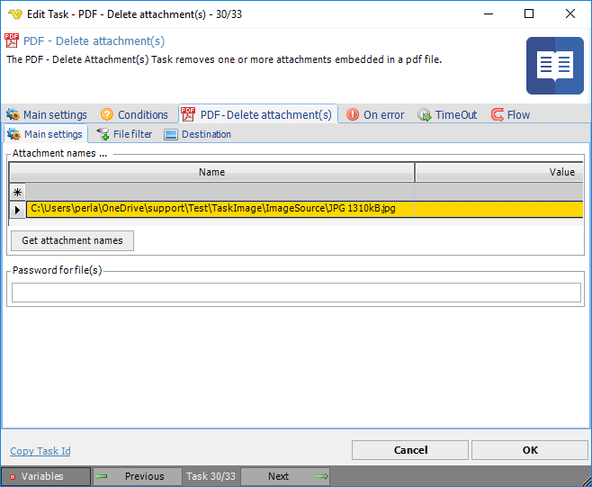
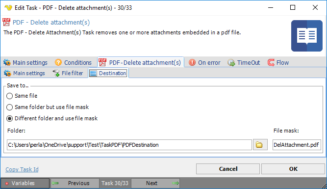

## Task PDF - Delete Attachment

The PDF - Delete attachment(s) Task removes one or more attachments embedded in a pdf file.
 
**Delete attachment(s) > Main settings** sub tab

In the *Delete Attachment(s) > Main settings* dialog you add or delete files to be deleted from a PDF file with attachments. Selection of file names is only possible for files included in the PDF file.
 
**Delete attachment(s) > File filter > Location** sub tab

This tab uses the common [file filter](../../job-tasks-file-filter.md) to filter out the files that should be processed in this Task.
 
**Delete attachment(s) > Destination** sub tab

**Save to**

The destination folder and file mask which the output file is saved to.
 
**Folder**

If *Different folder and use file mask* is selected, use manual folder specification or click the *Folder* icon.
 
**File mask**

Save file with different name.