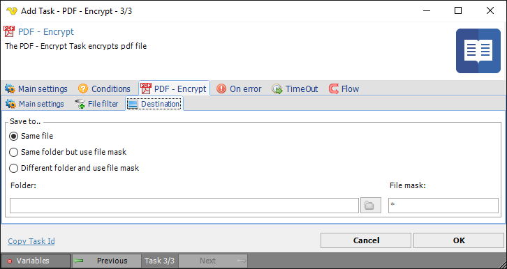

## Task PDF - Encrypt

The PDF - Encrypt Task encrypts existing PDF files with a password or a Certificate.
 
**Encrypt > Main settings** sub tab

**Certificate**

Select an existing Certificate you have created/imported in [Certificates manager](../../global-certificates).
 
**Password->Owner password**

Use this property to specify owner password.
 
**Password->User password**

Use this property to specify user password.
 
**Password->Permissions**

Use this property to specify user rights (permissions). User rights define, what actions can be performed when user's password is used for access.
 
**Encryption algorithm**

The encryption algorithm that will be used for encrypting the document. The following algorithms are available:

* AES/256 (Acrobat X)
* AES/256 (Acrobat 9)
* AES/128 (Acrobat 6,7)
* RC4/128 (Acrobat 5)
* RC4/40 (Acrobat 4)
 
**Encrypt metadata**

Use this property to specify if metadata are encrypted. Metadata contains some additional information about document such as its name, authors, etc. If value is True metadata will be encrypted.
 
**Encrypt > File filter > Location** sub tab

This tab uses the common [file filter](../../job-tasks-file-filter) to filter out the files that should be processed in this Task.
 
**Encrypt > Destination** sub tab

**Save to**

The destination folder and file mask which the output file is saved to.
 
**Folder**

If *Different folder and use file mask* is selected, use manual folder specification or click the *Folder* icon.
 
**File mask**

Save file with different name.