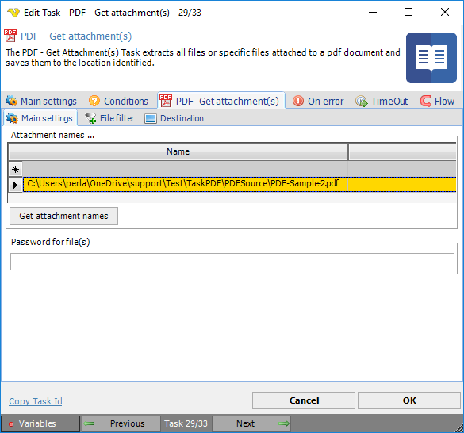
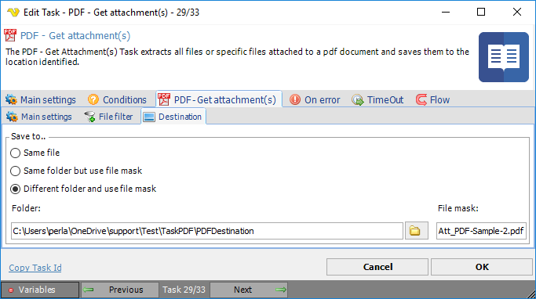

## Task PDF - Get Attachment

The PDF - Get attachment(s) Task extracts all files or specific files attached to a pdf document and saves them to the specified location file(s).
 
**Get attachment(s) > Main settings** sub tab

In the *Get Attachment(s) > Main settings* dialog you add or delete files to be retrieved from a PDF file with attachments. Selection of file names is only possible for files included in the PDF file.
 
**Get attachment(s) > File filter > Location** sub tab

This tab uses the common [file filter](../../job-tasks-file-filter.md) to filter out the files that should be processed in this Task.
 
**Get attachment(s) > Destination** sub tab

**Save t**o

The destination folder and file mask which the output file is saved to.
 
**Folder**

If *Different folder and use file mask* is selected, use manual folder specification or click the *Folder* icon.
 
**File mask**

Save file with different name.