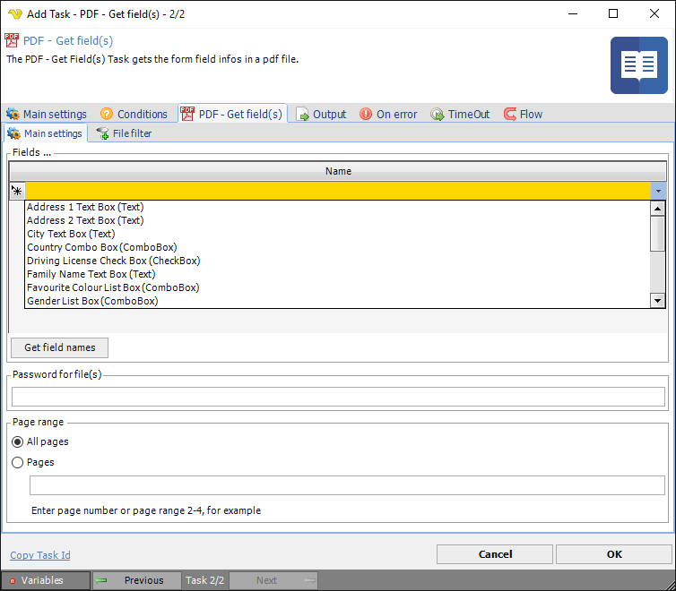
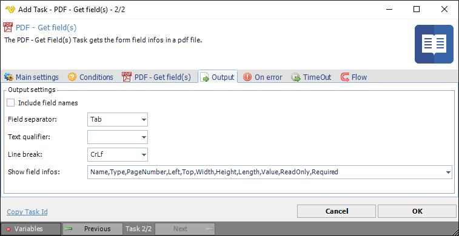

## Task PDF - Get Field

The PDF - Get field(s) Task returns value(s) from a PDF document based on field name(s).
 
**Get field(s) > Main settings** sub tab

**Fields grid**

Enter the name of the fields you want to retrieve. In the Output tab you control which value(s) of the field you want to retrieve. To delete a field select a row and press the Delete button.
 
**Get field names**

You are able to retrieve existing field names from one ore more documents according to the [file filter](../../job-tasks-file-filter). Be sure to specify the document(s) in the [file filter](../../job-tasks-file-filter).
 
**Password for file(s)**

If any of the specified PDF files contains a password it should be entered here
 
**Page range**

The pages that should be processed. Specify a range like 2-4 or specific pages 1,3,5-6.
 
**Get field(s) > File filter > Location** sub tab

This tab uses the common [file filter](../../job-tasks-file-filter) to filter out the files that should be processed in this Task.
 
**Get field(s) > Output** tab

**Include field names**

If the columns should be included in the output or not.
 
**Field separator**

Here you can control what separates each field.
 
**Text qualifier**

The text qualifier is the parts surrounding a field. Normally nothing which is default.
 
**Line break**

Controls what type of line break should be used.
 
**Show information**

The data from the document you want to include in output of Task.