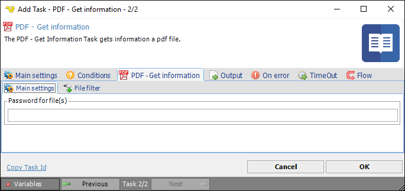
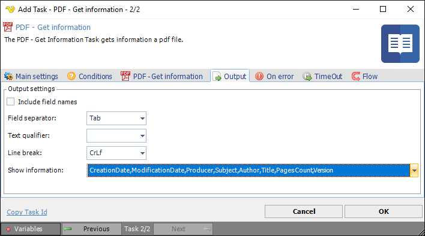

## Task PDF - Get Information

The PDF - Get information Task retrieves PDF information in a specified format.
 
**Get information > Main settings** sub tab

**Password for file(s)**

If any of the specified PDF files contains a password it should be entered here
 
**Get information > File filter > Location** sub tab

This tab uses the common [file filter](../../job-tasks-file-filter) to filter out the files that should be processed in this Task.
 
**Output** tab

**Include field names**

If the columns should be included in the output or not.
 
**Field separator**

Here you can control what separates each field.
 
**Text qualifier**

The text qualifier is the parts surrounding a field. Normally nothing which is default.
 
**Line break**

Controls what type of line break should be used.
 
**Show information**

The data from the document you want to include in output of Task.