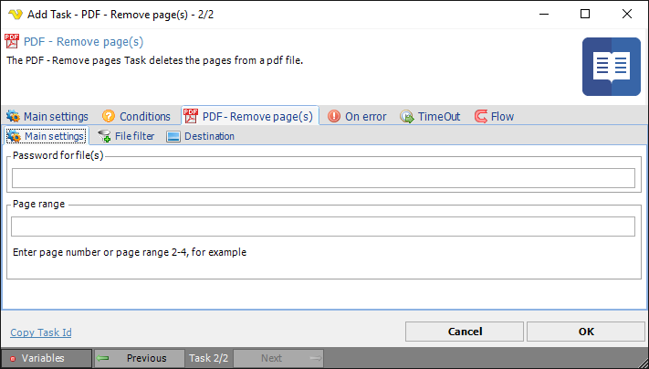
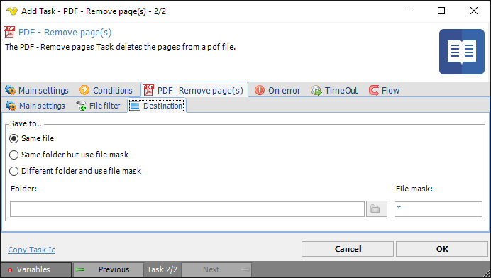

## Task PDF - Remove Page

The PDF - Remove pages(s) Task deletes one or more specified pages from a PDF document.
 
**Remove page(s) > Main settings** sub tab

**Password for file(s)**

If any of the specified PDF files contains a password it should be entered here.
 
**Page range**

The pages that should be removed. Specify a range like 2-4 or specific pages 1,3,5-6.
 
**Remove page(s) > File filter > Location** sub tab

This tab uses the common [file filter](../../job-tasks-file-filter) to filter out the files that should be processed in this Task.
 
**Remove page(s) > Destination** sub tab

**Save to**

The destination folder and file mask which the output file is saved to.
 
**Folder**

If *Different folder and use file mask* is selected, use manual folder specification or click the *Folder* icon.
 
**File mask**

Save file with different name.
