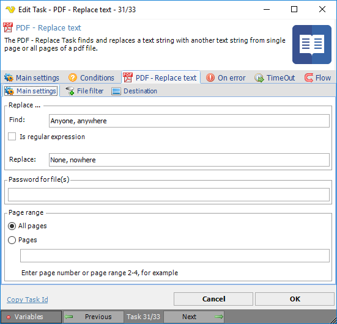
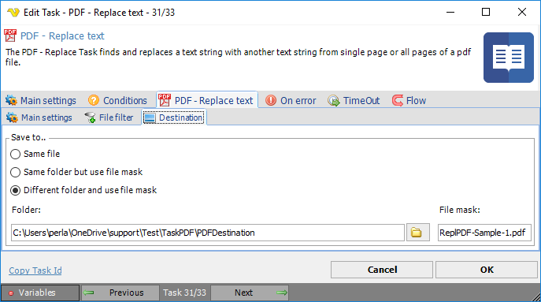

## Task PDF - Replace Text

The PDF - Replace text Task finds and replaces a text string with another text string from a single page or all pages of a pdf file.
 
**Replace text > Main settings** sub tab

**Find**

Text string to search for (quotation marks shall not be added).
 
**Is regular expression**

To be checked if the string in the *Find* field is a regular expression.
 
**Replace**

The text string to replace the found string with.
 
**Password for file(s)**

If the source pdf file is password protected, enter password here.
 
**Page range**

Select *All pages* or a page range for text replacement.
 
**Replace text > File filter > Location** sub tab

This tab uses the common [file filter](../../job-tasks-file-filter.md) to filter out the files that should be processed in this Task.
 
**Replace text > Destination** sub tab

**Save to**

The destination folder and file mask which the output file is saved to.
 
**Folder**

If *Different folder and use file mask* is selected, use manual folder specification or click the *Folder* icon.
 
**File mask**

Save file with different name.
