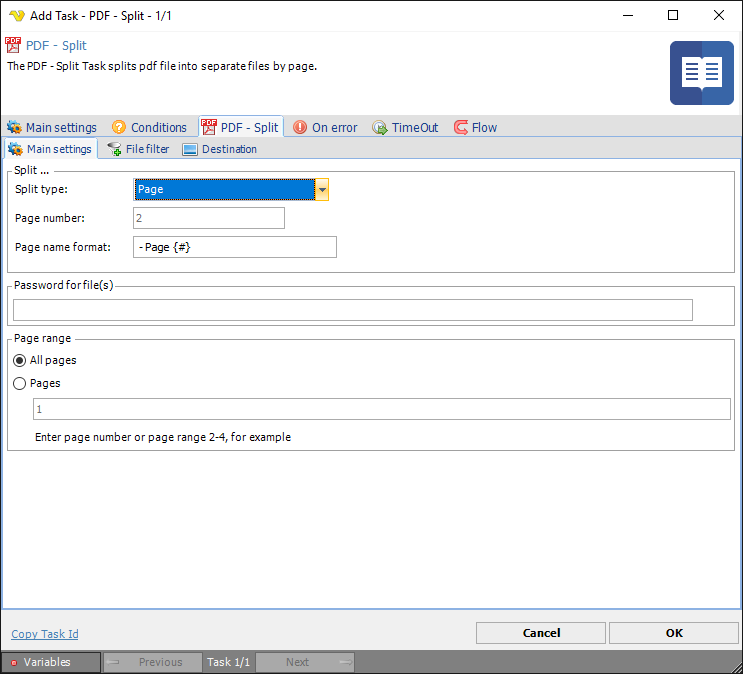
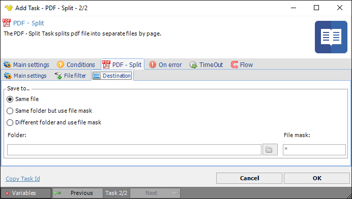

## Task PDF - Split

The PDF - Split Task is able to split a PDF document in half, at a specific page or per specific pages or into even/odd pages.
 
**Split > Main settings** sub tab

### Split type

How the pages should be split. The available options are:
 
**Half**  

The document will be split in half (or as close to half as possible) determined by the total number of pages in the document. The output files will consist of the original filename followed by the range of pages that were split enclosed in parenthesis (i.e. myDocument (1-4).pdf, myDocument (5-7).pdf)
 
**Page (default)**  

The document will be split into individual pages. The output files will consist of the original filename followed by an underscore and page number (i.e. myDocument - Page 1.pdf,  myDocument - Page 2.pdf, myDocument - Page 3.pdf, etc).
 
**Even / Odd**  

The document will be split into even and odd pages. The output files will consist of the original filename followed by the page type, either even or odd (i.e. myDocument_Even_Pages.pdf and myDocument_Odd_Pages.pdf).
 
**At**  

The document will be split at the page specified. The output files will consist of the original filename followed by the range of pages that were split enclosed in parenthesis (i.e. myDocument (1-2).pdf, myDocument (3-6).pdf).
 
**Page number**

The page number the actual split should occur on. This property is only used if the Split type is of type Split at.
 
**Page name format**

How the output files should be named. Variable `{#}` contains the page number.
 
**Password for file(s)**

If any of the specified PDF files contains a password it should be entered here.
 
**Page range**

**All pages** - cover split functionality on all pages

**Pages** - cover split functionality on specified page
 
**Split > File filter > Location** sub tab

This tab uses the common [file filter](../../job-tasks-file-filter) to filter out the files that should be processed in this Task.
 
**Split > Destination** sub tab

**Save to**

The destination folder and file mask which the output files are saved to.
 
**Folder**

If Different folder and use file mask is selected, use manual folder specification or click the *Folder* icon.
 
**File mask**

Save file with different name.