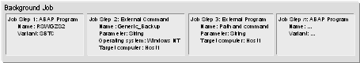
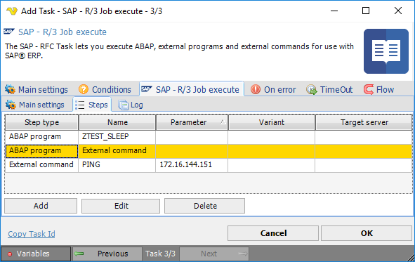
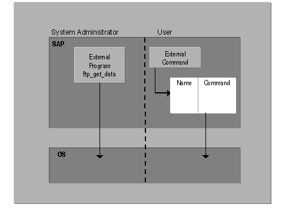
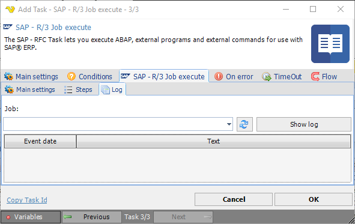

## Task SAP - R/3 Job Execute

The SAP - RFC Task lets you execute ABAP, external programs and external commands for use with SAP ERP.
 
**SAP - R/3 Job Execute > Main settings** sub tab

**Connection**

When connecting to a SAP server you need to setup a [SAP Connection](../../connection-sap.md). Click the Settings icon to open the Manage Connections dialog.
 
**Job**

The name of the SAP background job to execute.

**SAP user**

The SAP user account under which the job will run.

**Delete Job when complete**

When checked, the job is automatically deleted from the SAP system after it finishes executing.

**Wait for completion - with interval**

When checked, VisualCron waits for the SAP job to finish before continuing, polling for completion at the specified interval (in seconds). The default interval is 3 seconds.
 
**Job steps**

The work unit of the background processing system is the background job, each of which consists of one or more job steps.

In VisualCron the steps can be edited in the grid below:

**SAP - R/3 Job Execute > Step** sub tab

Jobs and job steps enable you to treat complex tasks as single units. That is, you can schedule several programs needed to complete a particular task as steps within a single job, with the advantage of the job being single logical container for all the steps needed to complete the task.
Example
 
Assume that a particular data transfer with batch input requires that you start two programs, an external program to prepare the batch-input session and an internal program to process the session. Creating a job made up of two steps lets you handle the two programs as a single unit. Scheduling that one job schedules both programs. The results of each program's run can be seen in the job log.
 
Some background processing attributes apply to entire jobs and, therefore, to all job steps within a job. For example, the earliest possible start time for any job steps will be the start time for the job.
 
**Step language**

If your SAP System runs with an Arabic, Cyrillic, or Asian character set, then you may need to change the language specified in the standard background jobs listed above. Languages are assigned to jobs based on job steps. Be sure that the language specified in the job step definition in each of these jobs is set to English (EN).
 
This change is required because not all languages are available with all code pages. If the job’s specified language is not available, the job will not run.
 
**Step types**

The background processing system makes a distinction between external commands for normal users and external programs for system administrators. You can see this distinction when scheduling a job from Transaction SM36, with separate fields for external commands and external programs. You can also call ABAP programs.
 
External commands are predefined, authorization-protected commands for end users. External programs are unrestricted, directly entered commands reserved for system administrators.
 
The type of external command and external program is unrestricted, meaning that you can use either compiled programs or scripts. Such programs can be run on any computer that can be reached from the SAP System. Parameter passing to non-SAP programs is completely unrestricted except by the predefinition mechanism for external commands.
 
Output of non-SAP programs, particularly error messages, is included in the job's log file.
 
Specifications required for an external command or program are:
 
*  External command + Type of operating system + (Parameters) + Target host system
* External program + Parameters + Target host system

**ABAP programs**

ABAP programs can be used as job steps. Module pools and function groups, which are collections of ABAP modules, are not allowed. The specifications required for an ABAP job step are:
 
ABAP program + Variant + Print and archiving parameters + Language
 
**External commands**

External commands are predefined commands for end users. They are operating-system independent and are protected by authorizations, so that normal end users can schedule only those commands that the system administrator permits them to.
 
With an external command, an ordinary end user—any user without background processing administrator authorization—may run a host system command or program that has been pre-defined by the administrator in the SAP System. The user who schedules the external command must have the authorization required for the external command.
 
External commands let you control what your users do outside the SAP System. End users can run only the commands and arguments that you specify in external command definitions. And you can control access to external commands with SAP authorizations.
 
For additional security, external command definitions are operating-system specific. For example, you can define variants of a command for UNIX and Windows NT hosts. A user who schedules an external command must specify the type of operating system in which the command is to run. The system then automatically selects the correct operating system variant or issues an error if the required variant has not been defined.
 
**External programs**

External programs are unrestricted commands that are neither pre-defined or restricted by authorizations. A user with administrator authorization can enter any of these in a job step.
 
With an external program, a system administrator can enter any desired host operating system command or program in a job step. No SAP authorizations test is carried out before executing the command.
 
External programs give an administrator—a user with the background processing administration authorization (authorization object S_BTCH_ADM Batch processing: Batch Administrator)—the flexibility to run any required host system command without any administrative preparation in the SAP System.
 
The purpose of this distinction is to let system administrators execute any required external program while restricting normal users to authorizations-tested external commands.
 
**SAP - R/3 Job Execute > Log** sub tab

**Job**

Select a previously executed SAP job from the dropdown to view its log. Use the refresh button to update the list, then click Show log to display the event log entries for the selected job, including event dates and messages.