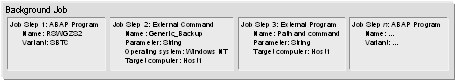
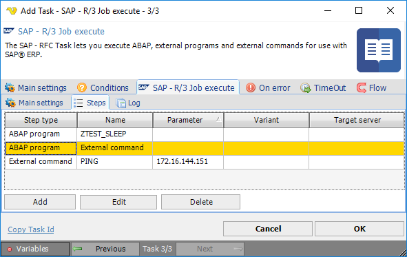
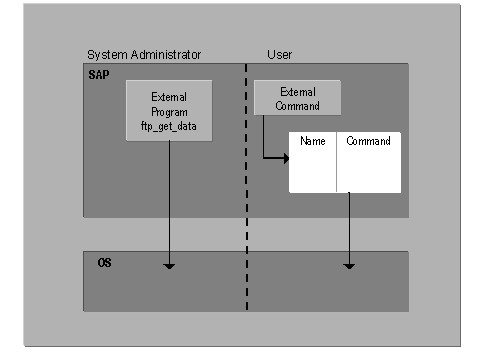
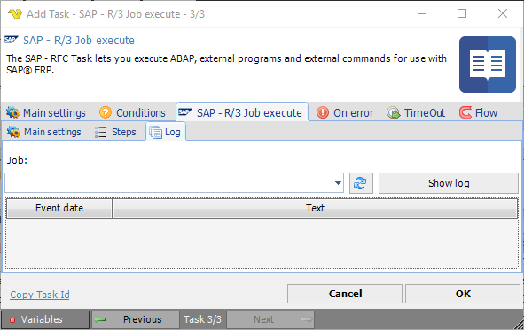

## Task SAP - R/3 Job Execute

The SAP - RFC Task lets you execute ABAP, external programs and external commands for use with SAP ERP.
 
**SAP - R/3 Job Execute > Main settings** sub tab

**Connection**

When connecting to a SAP server you need to setup a [SAP Connection](../../connection-sap.md). Click the Settings icon to open the Manage Connections dialog.
 
**Job**

The name of the SAP background job to execute.

**SAP user**

The SAP user account under which the job will run.

**Delete Job when complete**

When checked, the job is automatically deleted from the SAP system after it finishes executing.

**Wait for completion - with interval**

When checked, VisualCron waits for the SAP job to finish before continuing, polling for completion at the specified interval (in seconds). The default interval is 3 seconds.
 
**Job steps**

The work unit of the background processing system is the background job, each of which consists of one or more job steps.

In VisualCron the steps can be edited in the grid below:

**SAP - R/3 Job Execute > Steps** sub tab

Jobs and job steps enable you to treat complex tasks as single units. That is, you can schedule several programs needed to complete a particular task as steps within a single job, with the advantage of the job being single logical container for all the steps needed to complete the task.
 
The steps grid displays the following columns: **Step type**, **Name**, **Parameter**, **Variant**, and **Target server**.

Use the **Add**, **Edit**, and **Delete** buttons to manage steps. Double-clicking a row opens the edit dialog.

**Add/Edit SAP step dialog**
 
**Step type**

The type of step to execute. Available options:

* _ABAP_ - runs an ABAP program; enables the Variant field and disables Parameter and Target server
* _External command_ - runs a predefined, authorization-protected command; enables Parameter and Target server and disables Variant
* _External program_ - runs an unrestricted host operating system command or program; enables Parameter and Target server and disables Variant

**Name**

The name of the ABAP program, external command, or external program to run. Click the Refresh button to populate the list of available programs or commands from the SAP system (available for ABAP and External command step types).

**Variant**

The variant to use when running the ABAP program. Click the Refresh button to load available variants for the selected program. Only enabled when the step type is _ABAP_.

**Parameter**

Parameters to pass to the external command or external program. Only enabled when the step type is _External command_ or _External program_.

**Target server**

The target host system on which the external command or external program will run. Only enabled when the step type is _External command_ or _External program_.

**Step types**

The background processing system makes a distinction between external commands for normal users and external programs for system administrators. You can see this distinction when scheduling a job from Transaction SM36, with separate fields for external commands and external programs. You can also call ABAP programs.
 
ABAP programs can be used as job steps. Module pools and function groups, which are collections of ABAP modules, are not allowed. The specifications required for an ABAP job step are: ABAP program + Variant + Language.

External commands are predefined, authorization-protected commands for end users. They are operating-system independent and are protected by authorizations, so that normal end users can schedule only those commands that the system administrator permits them to.

External programs are unrestricted commands that are neither pre-defined nor restricted by authorizations. A user with administrator authorization can enter any of these in a job step.

 
**SAP - R/3 Job Execute > Log** sub tab

**Job**

Select a previously executed SAP job from the dropdown to view its log. Use the refresh button to update the list, then click Show log to display the event log entries for the selected job, including event dates and messages.
