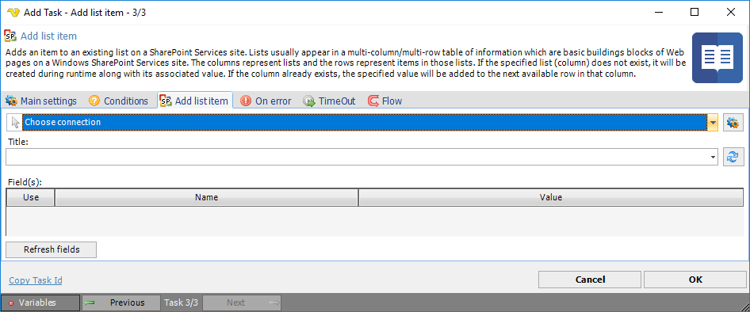

## Task Sharepoint- Add List Item

Adds an item to an existing list on a SharePoint Services site. Lists usually appear in a multi-column/mult-row table of information which are basic building blocks of Web pages on a Windows SharePoint Services site. The columns represent lists and the rows represent items in those lists. If the specified list (column) does not exist, it will be created during runtime along with its associated value. If the column already exists, the specified value will be added to the next available row in that column.
 
The SharePoint - Update List Task updates a List in the SharePoint library.
 
The SharePoint Tasks supports the following versions:

* SharePoint 2010
* SharePoint 2013
* SharePoint Online

**Connection**

To use SharePoint Tasks you need to create a [Connection](../../global-connections) first. Click the *Settings* icon to open the *Manage Connections* dialog.
 
**Title**

The title of an exiting list to be added.
 
**Field(s)**

Text ...
Click the *Refresh fields* button to update all available fields.