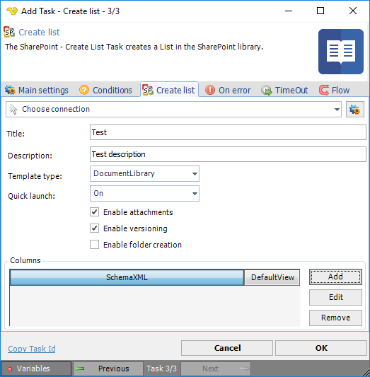
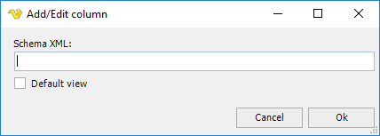

## Task Sharepoint- Create List

The SharePoint - Create List Task creates a List in the SharePoint library.
 
The SharePoint Tasks supports the following versions:

* SharePoint 2010
* SharePoint 2013
* SharePoint Online

**Connection**

To use SharePoint Tasks you need to create a [Connection](../../global-connections) first. Click the Settings icon to open the Manage Connections dialog.
 
**Title**

The title of the group to create.
 
**Description**

A user defined description of the group to create.
 
**Template type**

Specifies a list template. Click the drop-down list and select an item from the list of available templates.
 
**Quick launch**

Specifies whether the list should be a quick launch item. The available options are:

* On
* Off
* DefaultValue
 
**Enable attachments**

If checked, specifies that list item attachments are enabled for the list. This parameter is unchecked by default.
 
**Enable versioning**

If checked. specifies that historical versions of list items and documents can be created in the list. This parameter is unchecked by default.
 
**Enable folder creation**

If checked, specifies that new list folders can be added to the list. This parameter is unchecked by default.
 
**Columns**

Columns are created by clicking the Add button using a Microsoft xml format.
Read more here: [http://msdn.microsoft.com/en-us/library/office/ms457586.aspx](http://msdn.microsoft.com/en-us/library/office/ms457586.aspx)

