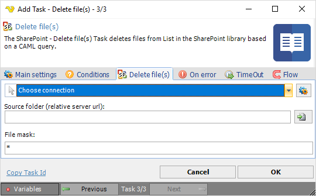

## Task Sharepoint- Delete File

The SharePoint - Delete file(s) Task deletes files from List in the SharePoint library based on a CAML query.
 
The SharePoint Tasks supports the following versions:

* SharePoint 2010
* SharePoint 2013
* SharePoint Online

**Connection**

To use SharePoint Tasks you need to create a [Connection](../../global-connections) first. Click the *Settings* icon to open the *Manage Connections* dialog.
 
**Source folder**

The source folder for the files. Click the *Folder* icon to browse a SharePoint site in order to view or select a specific folder.
 
**File mask**

Use wild cards to find and delete one or more files.