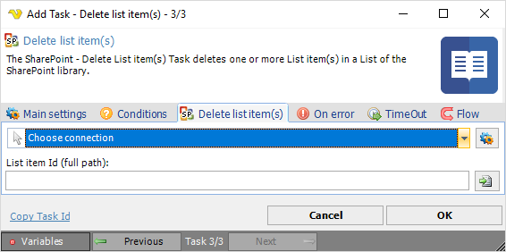

## Task Sharepoint- Delete List Item

The SharePoint - Delete List item(s) Task deletes one or more List item(s) in a List of the SharePoint library.
 
The SharePoint Tasks supports the following versions:

* SharePoint 2010
* SharePoint 2013
* SharePoint Online

**Connection**

To use SharePoint Tasks you need to create a [Connection](../../global-connections) first. Click the *Settings* icon to open the *Manage Connections* dialog.
 
**List item id**

The Id of the list item. Click the *Folder* icon to select.