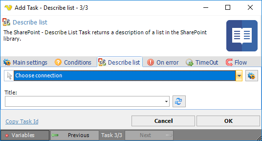

## Task Sharepoint- Describe List

The SharePoint - Describe List Task returns a description of a list in the SharePoint library.
 
The SharePoint Tasks supports the following versions:

* SharePoint 2010
* SharePoint 2013
* SharePoint Online

**Connection**

To use SharePoint Tasks you need to create a [Connection](../../global-connections) first. Click the *Settings* icon to open the *Manage Connections* dialog.
 
**Title**

The title of the List to describe. Click the *Refresh* icon to list available Lists.