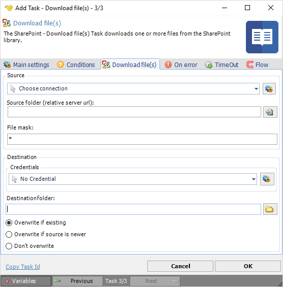

## Task Sharepoint- Download File

The SharePoint - Download file(s) Task downloads one or more files from the SharePoint library.
 
The SharePoint Tasks supports the following versions:

* SharePoint 2010
* SharePoint 2013
* SharePoint Online

**Connection**

To use SharePoint Tasks you need to create a [Connection](../../global-connections) first. Click the *Settings* icon to open the *Manage Connections* dialog.
 
**Source folder**

The source URL of the file to download. Click the *Folder* icon to use the SharePoint Browser in order to view or select a specific contents such as files, folders and attachments.
 
**File mask**

Use wild cards to find and delete one or more files.
 
**Credentials**

To control a remote computer you may need to use a Credential. The Credential must match the user name and pass word of the user that you want to login. Click on *Manage credentials* to add or edit Credentials. Select a Credential in the combo box.
 
**Destination folder**

The folder that you want to save the files in. Click on the folder icon to select folder.
 
**Overwrite options**

Optionally you can choose if you want to overwrite any existing file(s) based on if existing or date. If *Don't overwrite* is selected, this task fails if files with the same name are found in the destination.