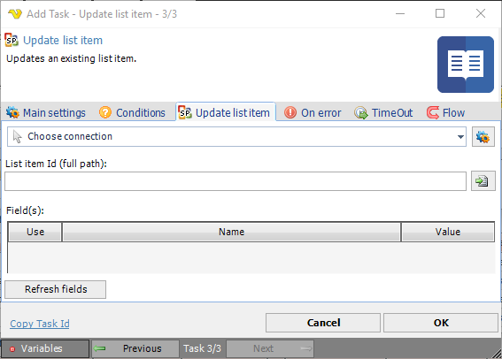

## Task Sharepoint- Update List Item

The SharePoint - Update List Task updates a List in the SharePoint library.
 
The SharePoint Tasks supports the following versions:

* SharePoint 2010
* SharePoint 2013
* SharePoint Online

**Connection**

To use SharePoint Tasks you need to create a [Connection](../../global-connections) first. Click the *Settings* icon to open the *Manage Connections* dialog.
 
**List item Id (full path)**

The title of the list to be updated. Click the Folder icon to browse a SharePoint site in order to view or select a specific item.
 
**Field(s)**

Text ...
Click the *Refresh fields* button to update all available fields.