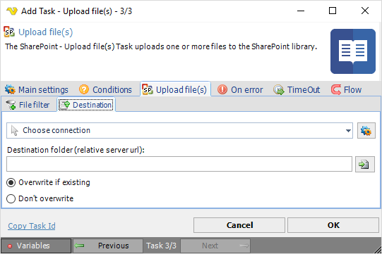

## Task Sharepoint- Upload File

The SharePoint - Upload file(s) Task uploads one or more files to the SharePoint library.
 
The SharePoint Tasks supports the following versions:

* SharePoint 2010
* SharePoint 2013
* SharePoint Online
 
**Upload file(s) > File filter > Location** sub tab

The List file(s) Task uses the standard VisualCron [File filter](../../job-tasks-file-filter) to define the properties of the listed files.
 
**Upload file(s) > Destination** sub tab

**Connection**

To use SharePoint Tasks you need to create a [Connection](../../global-connections) first. Click the *Settings* icon to open the *Manage Connections* dialog.
 
**Destination folder**

The destination folder for the files. Click the *Folder* icon to browse a SharePoint site in order to view or select a specific folder.
 
**Overwrite**

Optionally you can choose if you want to overwrite any existing file(s). If *Don't overwrite* is selected, this task fails if files with the same name are found in the destination.
 
 
### Troubleshooting
 
**File Not Found**

Please check so that destination folder does not end with a forward slash `/`