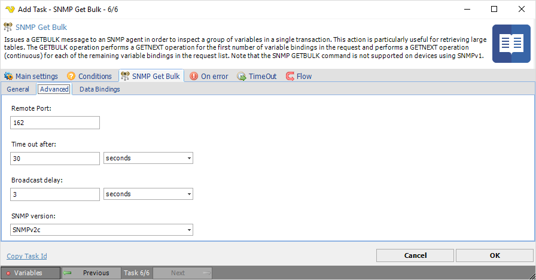
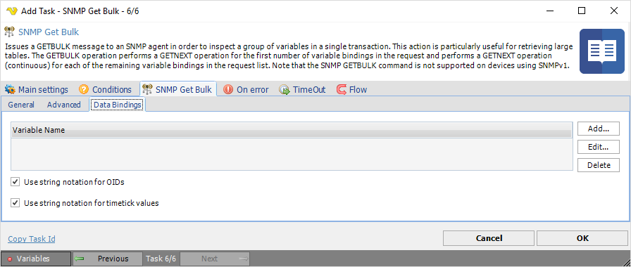

## Task SNMP - SNMP Get Bulk

Issues a GETBULK message to an SNMP agent in order to inspect a group of variables in a single transaction. This action is particularly useful for retrieving large tables. The GETBULK operation performs a GETNEXT operation for the first number of variable bindings in the request and performs a GETNEXT operation (continuous) for each of the remaining variable bindings in the request list. Note that the SNMP GETBULK command is not supported on devices using SNMPv1.
 
**SNMP Get Bulk > General** tab

**Agent IP Address**

Text ...
 
**Return variable name for the first**

Text ...
 
**Community**

Text ...
 
**SNMP Get Bulk > Advanced** tab

**Remote Port**

Text ...
 
**Time out after**

Text ...
 
**Broadcast delay**

Text ...
 
**SNMP version**

Text ...
 
**SNMP Get Bulk > Data bindings** tab

**Variable name**

Text ...
 
**Use string notation for OIDs**

Text ...
 
**Use string notation for timetick values**

Text ...