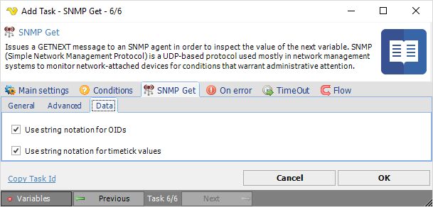

## Task SNMP - SNMP Get

Issues a GETNEXT message to an SNMP agent in order to inspect the value of the next variable. SNMP (Simple Network Management Protocol) is an UDP-based protocol used mostly in network management systems to monitor network-attached devices for conditions that warrant administrative attention.
 
**SNMP Get > General** tab

**Agent IP Address**

Text ...
 
**Variable name**

Text ...
 
**Community**

Text ...
 
**SNMP Get > Advanced** tab

**Remote Port**

Text ...
 
**Time out after**

Text ...
 
**Broadcast delay**

Text ...
 
**SNMP version**

Text ...
 
**SNMP Get > Data** tab

**Use string notation for OIDs**

Text ...
 
**Use string notation for timetick values**

Text ...