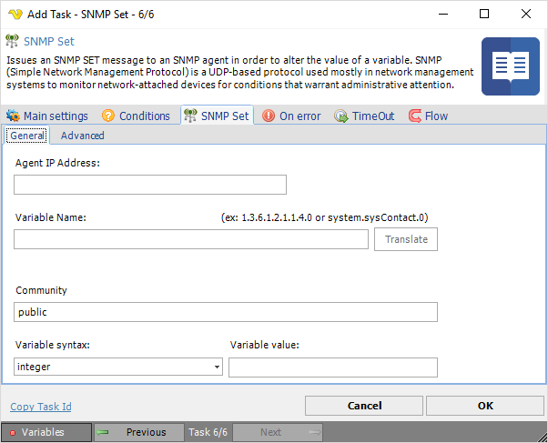
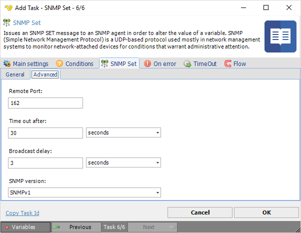

## Task SNMP - SNMP Set

Issues a SNMP SET message to an SNMP agent in order to alter the value of the variable. SNMP (Simple Network Management Protocol) is a UDP-based protocol used mostly in network management systems to monitor network-attached devices for conditions that warrant administrative attention.
 
**SNMP Set > General** tab

**Agent IP Address**

Text ...
 
**Variable name**

Text ...
 
**Community**

Text ...
 
**Variable**

Text ...
 
**SNMP Set > Advanced** tab

**Remote Port**

Text ...
 
**Time out after**

Text ...
 
**Broadcast delay**

Text ...
 
**SNMP version**

Text ...