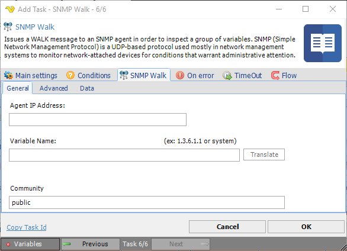
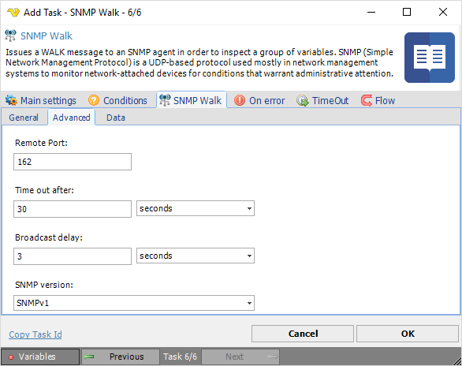
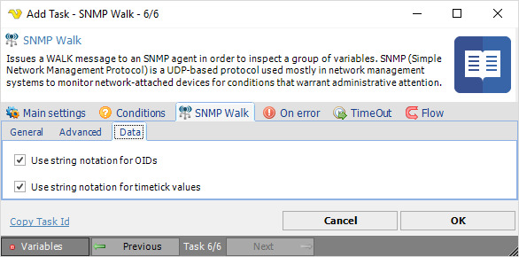

## Task SNMP - SNMP Walk

Issues a Walk message to an SNMP agent in order to inspect a group of variables. SNMP (Simple Network Management Protocol) is a UDP-based protocol used mostly in network management systems to monitor network-attached devices for conditions that warrant administrative attention.
 
**SNMP Walk > General** tab

**Agent IP Address**

Text ...
 
**Variable name**

Text ...
 
**Community**

Text ...
 
**SNMP Walk > Advanced** tab

**Remote Port**

Text ...
 
**Time out after**

Text ...
 
**Broadcast delay**

Text ...
 
**SNMP version**

Text ...
 
**SNMP Walk > Data** tab

**Use string notation for OIDs**

Text ...
 
**Use string notation for timetick values**

Text ...