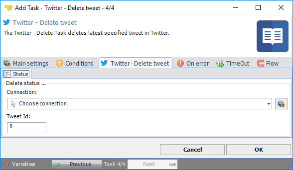

## Task Social - Twitter - Delete Tweet

The Social - Twitter delete tweet Task deletes latest or specified tweet in Twitter.

**Connection**

To use Twitter Tasks you need to create a Connection first. You do that in the [Twitter Connection](../../../server/connection-twitter) dialog.
 
**Tweet Id**

The tweet id to be retrieved where 0 specifies the latest tweet. The retrieved tweet is presented in output of the task.