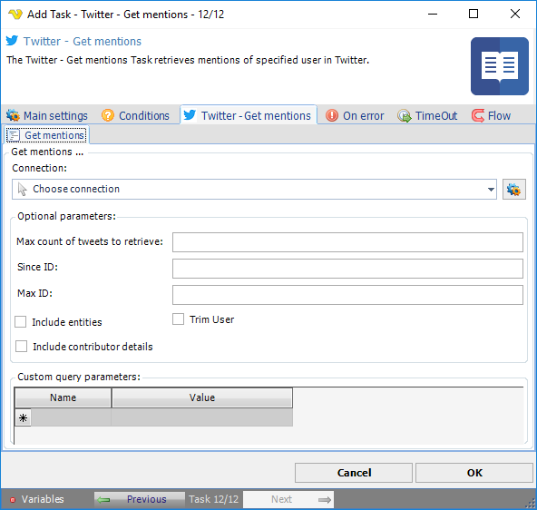

## Task Social - Twitter - Get Mentions

The Twitter - Get mentions Task retrieves of specified user in Twitter.

**Connection**

To use Twitter Tasks you need to create a Connection first. You do that in the [Twitter Connection](../../../server/connection-twitter) dialog.
 
**Max count of tweets to retrieve**

Specifies the number of Tweets to try and retrieve, up to a maximum of 200 per distinct request.
 
**Since ID**

Returns results with an ID greater than (that is, more recent than) the specified ID.
 
**Max ID**

Returns results with an ID less than (that is, older than) or equal to the specified ID.
 
**Include entities**

The entities node will not be included when not checked.
 
**Trim user**

When checked, each Tweet returned in a timeline will include a user object including only the status authors numerical ID.
 
See Twitter Developer Documentation for detailed [GET mentions](https://developer.twitter.com/en/docs/api-reference-index) information.