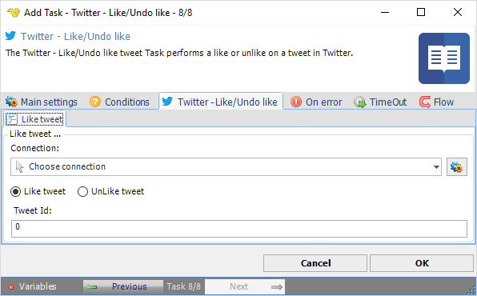

:::warning

**Deprecated**

Twitter integration described on this page is deprecated from **VisualCron v13.2.1**.

:::

## Task Social - Twitter - Like/Undo Like

The Twitter - Like/Undo like tweet Task performs a like or unlike on a tweet in Twitter.

**Connection**

To use Twitter Tasks you need to create a Connection first. You do that in the [Twitter Connection](../../../server/connection-twitter) dialog.
 
**Unlike Tweet**

Removes a previous liked tweet.
 
**Tweet ID**

Number part in link to tweet.