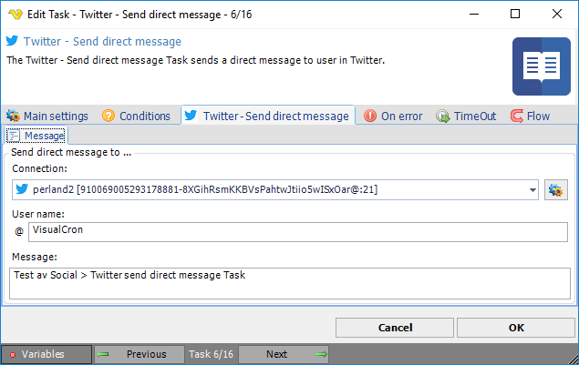

## Task Social - Twitter - Send Direct Message

The Social - Twitter Send direct message Task sends a direct message to a user in Twitter.

**Connection**

To use Twitter Tasks you need to create a Connection first. You do that in the [Twitter Connection](../../../server/connection-twitter) dialog.
 
**User name**

Twitter user to send message to.
 
:::info Note

You cannot send a message to a user who are not following you.

:::