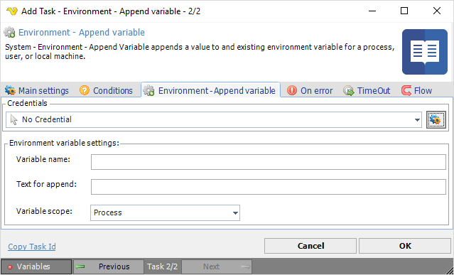

## Task System - Environment - Append Variable

System - Environment - Append variable appends a value to an existing environment variable for a process, user or local machine.

**Variable name**

The name of a new variable to be appended.
 
**Text for append**

The value to be used by the variable name.
 
**Variable scope**

Select Process, User or Machine variable scope. These variable scopes refers, more or less, to Windows 10 Process, User and System variables. The Windows process variables consist of Windows User and System variables.

