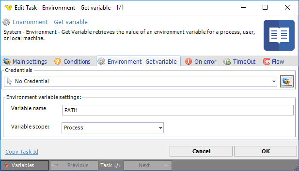

## Task System - Environment - Get Variable

System - Environment - Get variable retrieves the value of an environment variable for a process, user or local machine.

**Credential**

To control a remote computer you may need to use a Credential. The Credential must match the user name and password of the user that you want to login for. Select a Credential in the combo box or click the *Settings* icon to open *Manage credentials* in order to add or edit Credentials.
 
**Variable name**

The name of an exiting variable contained in the selected scope.
 
**Variable scope**

Select Process, User or Machine variable scope. These variable scopes refers, more or less, to Windows 10 Process, User and System variables. The Windows process variables consist of Windows User and System variables.