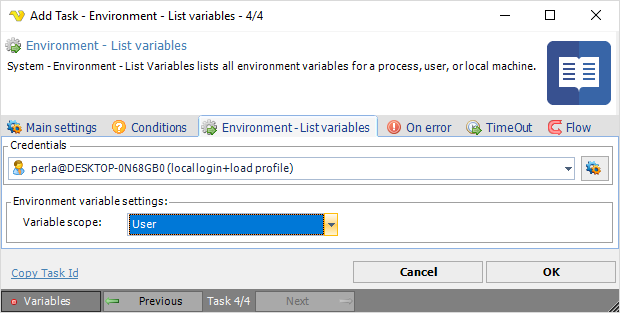

## Task System - Environment - List Variables

System - Environment - List variables lists all variables  for a process, user or local machine.

**Variable scope**

Select Process, User or Machine variable scope. These variable scopes refers, more or less, to Windows 10 Process, User and System variables. The Windows process variables consist of Windows User and System variables.
 
The Windows 10 **User environment variables** are stored in the registry key below:

`HKEY_CURRENT_USER\Environment`
 
The Windows 10 **System environment variables** are stored in the registry key below:

`HKEY_LOCAL_MACHINE\SYSTEM\CurrentControlSet\Control\Session Manager\Environment`