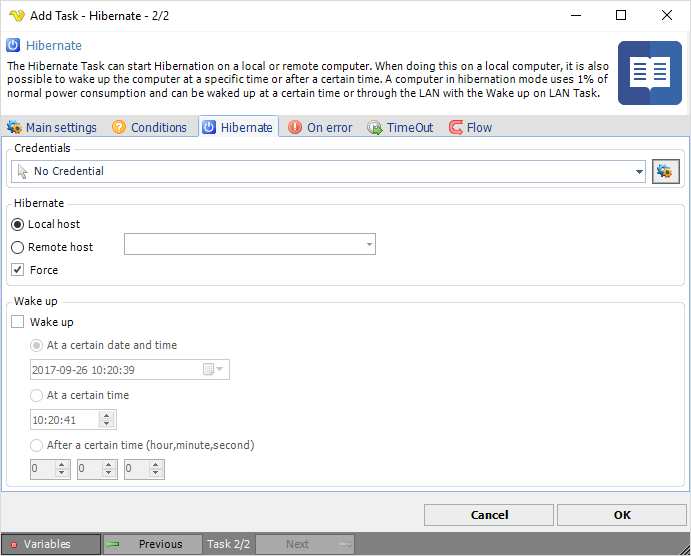

## Task System - Hibernate

The Hibernate Task can start Hibernation on a local or remote computer. When doing this on a local computer, it is also possible to wake up the computer at a specific time or after a certain time. A computer in hibernation mode uses 1% of normal power consumption and can be waked up at a certain time or through the LAN with the Wake up on LAN Task.
 
Hibernate mode writes an image of what you're currently working on to a special file on your hard drive, and then shuts your computer almost completely off. It takes a bit longer than Standby, since the writing process. Hibernate also takes a bit longer to resume, since you must go through essentially the normal boot process, although in Windows XP your computer wakes faster from Hibernate than in previous versions of Windows. The advantage is that you can leave your laptop in Hibernate mode for days without any negative effect. When you restart, you'll see everything exactly as you left it. Hibernate is the perfect mode for shutting down for the night or even the weekend.

**Credentials**

To control a remote computer you may need to use a Credential. The Credential must match the user name and password of the user that you want to login for. Select a Credential in the combo box or click the *Settings* icon to open *Manage credentials* in order to add or edit Credentials.
 
**Local or Remote**

Select the the Local server radio button if you want to control the local computer, select the Remote server radio button if you want to control a remote computer.
 
**Hostname**

The name of the remote computer.
 
**Force**

Force suspend/hibernate = do not send permission request to applications.
 
**Wake up**

Turns on or off wake up.
 
**At a certain date and time**

Wakes up the computer at the specified year, month, day, hour, minute and second.
 
**At a certain time**

Wakes up the computer at the specified hour, minute and second.
 
**After a certain time**

Wakes up the computer after a certain time; hour, minute and second.
 

:::info Note

**Remark on Wake Up** 

Some computers can wake up from standby and not from hibernation, some work for both, and some for none. It all depends on the BIOS and the APM/ACPI capabilities, your motherboard, and your ATX power supply version.

:::