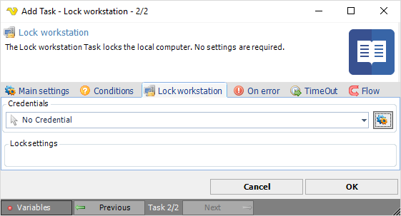

## Task System - Lock Workstation

The Lock workstation Task locks the local computer. No settings are required.

**Credentials**

To control a remote computer you may need to use a Credential. The Credential must match the user name and password of the user that you want to login for. Select a Credential in the combo box or click the *Settings* icon to open *Manage credentials* in order to add or edit Credentials.
 
**Lock settings**

Text ...