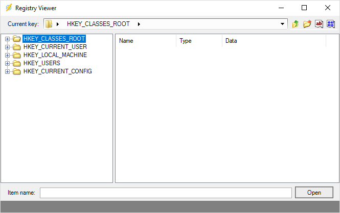

## Task System - Registry

The Registry Task can perform various registry actions like read, rename and write values.

There are 7 kinds of registry Tasks:
 
**Read value data**

Reads a specific value based on *Registry key* and *Value Name*. Read value is stored in standard output of Task.
 
**Create/Change value data**

Creates or changes a value based on a name. You must also specify data type, String or DWORD.
 
**Delete value**

Deletes a specified value based on *Registry key* and *Value Name*.
 
**Rename value**

Deletes a specified value based on *Registry key* and *Value Name* and *New Value Name*.
 
**Create key**

Creates a Registry key.
 
**Delete key**

Deletes a Registry key.
 
**Rename key**

Renames a Registry key.
 
**Browse button**

Anytime you can click on the browse button to view or change the registry by yourself.

