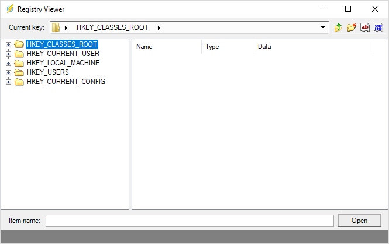

## Task System - Registry

The Registry Task can perform various registry actions like read, rename and write values.

**Type of Registry task**

Select the type of registry operation to perform.
 
**Read value data**

Reads a specific value from the registry. The value is returned as the Task output.
 
**Create/Change value data**

Creates or changes a registry value. When selected, also specify the data type:

* **String** — the value data is a string.
* **DWORD** — the value data is a 32-bit integer.
 
**Delete value**

Deletes a specified registry value.

**Rename Value**

Renames a specified registry value.

**Create key**

Creates a registry key.

**Delete key**

Deletes a registry key.

**Rename key**

Renames a registry key.

**Registry key**

The full path to the registry key. Click the browse button to open the registry browser where you can navigate and select a key.

**Value name**

The name of the registry value to act on. Used when the task type is **Read value data**, **Create/Change value data**, **Delete value**, or **Rename Value**.

**Value data**

The data to write to the registry value. Only available when the task type is **Create/Change value data**.

**New name**

The new name to assign. Available when the task type is **Rename Value** (renames the value) or **Rename key** (renames the key).
