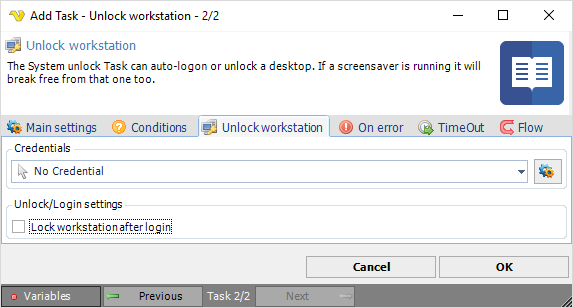

## Task System - Unlock Workstation

The System Unlock workstation Task can auto-login or unlock a desktop. If a screen saver is running it will break free from that one too.

**Credentials**

To control a remote computer you may need to use a Credential. The Credential must match the user name and pass word of the user that you want to login. Click on *Manage credentials* to add or edit Credentials. Select a Credential in the combo box.
 
**Unlock/Login settings**

Text ...
 
:::info Note 

For Windows Server 2008 you must [enable a setting in Local Security Policy](security-interactive-logon).

:::