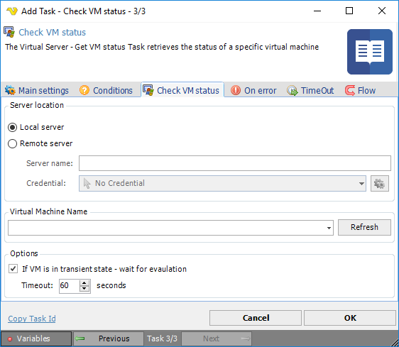

## Task Virtual Server - Check VM Status

The Virtual Server - Check VM status Task retrieves the status of a specific virtual machine.

**Local or Remote**

Select the the *Local server* radio button if you want to control the local computer, select the *Remote server* radio button if you want to control a remote computer.
 
**Server name**

The name of the remote server.
 
**Credential**

To control a remote computer you may need to use a Credential. The Credential must match the user name and pass word of the user that you want to login. Click on *Manage credentials* to add or edit Credentials. Select a Credential in the combo box.
 
**Virtual Machine Name**

The host name of the virtual machine, Click the *Refresh* button to populate connected virtual machine names.
 
**If VM status is in transient state - wait for evaluation**

Text ...