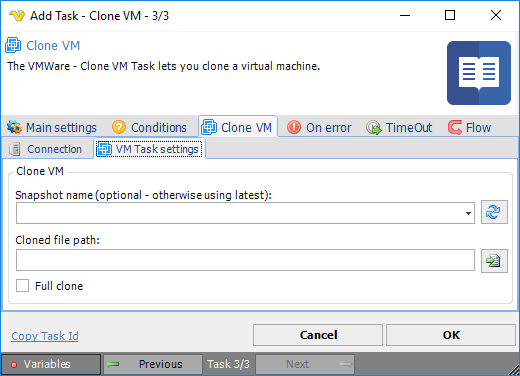

## Task VMWare - Clone VM

The VMWare - Clone VM Task lets you clone a virtual machine.
 
**Clone VM > Connection** sub tab
The Connection settings window is the same for all VMWare Task types. See [Start VM](start-vm) for details.
 
**Clone VM > VM Task settings** sub tab

**Snapshot name**

The name of the snapshot - if none specified the latest will be used. Click the *Refresh* icon to populate the drop-down snapshot name list.
 
**Cloned file path**

The path where the cloned file should be placed. Click the *Folder* icon to set folder for the cloned file.
 
**Full clone**

**Full clone checked** 

Creates a full, independent clone of the virtual machine.

**Full clone unchecked** 

Creates a linked clone, which is a copy of a virtual machine that shares virtual disks with the parent virtual machine in an ongoing manner. This conserves disk space as long as the parent and clone do not change too much from their original state.