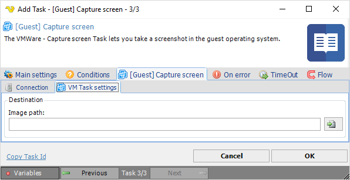

## Task VMWare - [Guest] Capture Screen

The VMWare - Capture screen Task lets you take a screenshot in the guest operating system.
 
**[Guest] Capture screen > Connection** sub tab

The Connection settings window is the same for all VMWare Task types. See [Start VM](start-vm) for details.
 
**[Guest] Capture screen > VM Task settings** sub tab

**Image path**

Full path to the image (png) file where the captured screen should be saved to. Click the *Folder* icon to browse folders and select a folder.