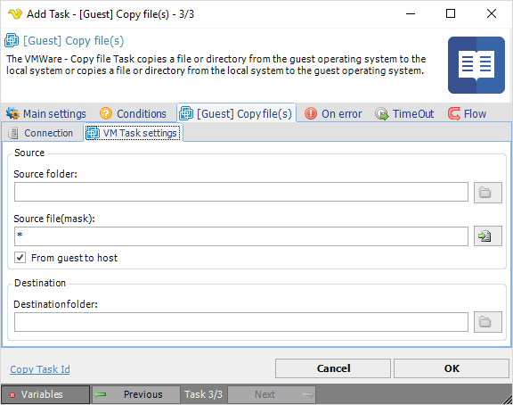

## Task VMWare - [Guest] Copy File

The VMWare - Copy file Task copies a file or directory from the guest operating system to the local system or copies a file or a directory from the local system to the guest operating system.
 
**[Guest] Copy file(s) > Connection** sub tab

The Connection settings window is the same for all VMWare Task types. See [Start VM](start-vm) for details.
 
**[Guest] Copy file(s) > VM Task settings** sub tab

**Source folder**

The folder you want to copy files from. Click the *Folder* icon to browse folders and select a folder.
 
**Source file (mask)**

File mask or name of file you want to copy. Click the *File* icon to browse file according to file mask and select a file.
 
**From guest to host**

Which direction the file should be copied. By default it it copying from the guest to host.
 
**Destination folder**

The folder you want to copy files to. Click the *Folder* icon to browse folders and select a folder.