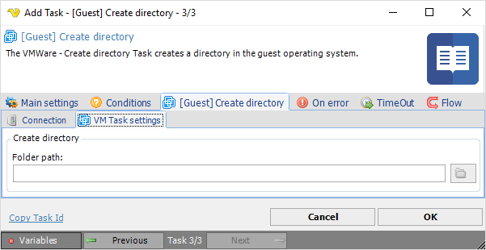

## Task VMWare - [Guest] Create Directory

The VMWare - Create directory Task creates a directory in the guest operating system.
 
**[Guest] Create directory > Connection** sub tab

The Connection settings window is the same for all VMWare Task types. See [Start VM](start-vm) for details.
 
**[Guest] Create directory > VM Task settings** sub tab

**Folder**

The folder you want to create. Click the *Folder* icon to browse folders.