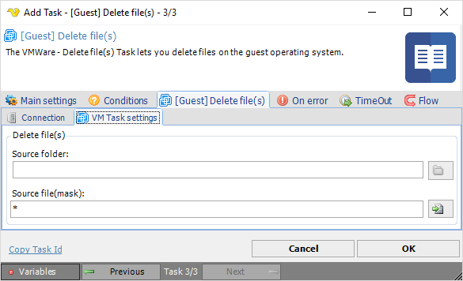

## Task VMWare - [Guest] Delete File

The VMWare - Delete file(s) Task lets you delete files on the guest operating system.
 
**[Guest] Delete file(s) > Connection** sub tab
The Connection settings window is the same for all VMWare Task types. See [Start VM](start-vm) for details.
 
**[Guest] Delete file(s) > VM Task settings** sub tab

**Source folder**

The folder you want to delete files from. Click the *Folder* icon to browse folders.
 
**Source file (mask)**

File mask or name of file you want to delete. Click the *File* icon to browse files according to file mask and select file(s) to be deleted.

