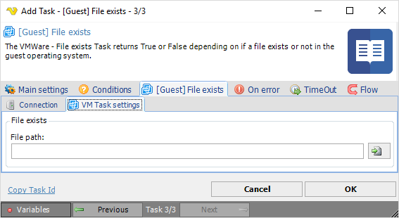

## Task VMWare - [Guest] File Exists

The VMWare - File exists Task returns True or False depending on if a file exists or not in the guest operating system.
 
**[Guest] File exists > Connection** sub tab

The Connection settings window is the same for all VMWare Task types. See [Start VM](start-vm) for details.
 
**[Guest] File exists > VM Task settings** sub tab

**File path**

The full path to file you want to check if existing. Click the *File* icon to browse files.